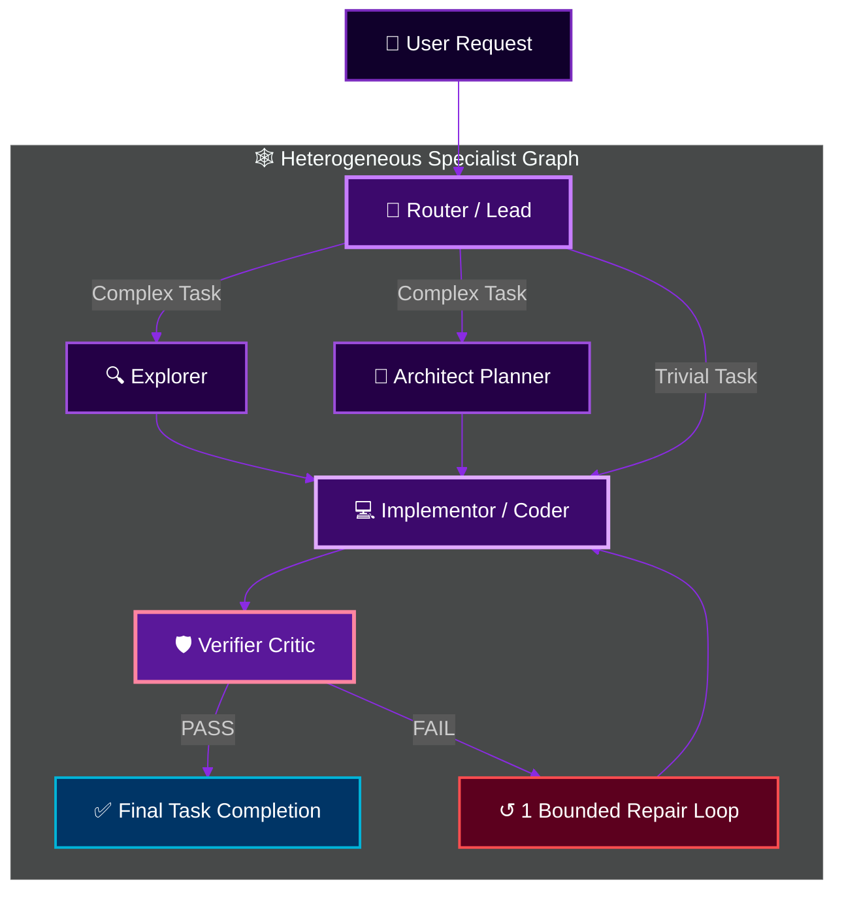

<p align="right">
  <a href="./README.md"><strong>English</strong></a> · <a href="./HETEROGENEOUS_AGENTS.md"><strong>Architecture Specs</strong></a>
</p>

<p align="center">
  
</p>

<div align="center">

[](https://github.com/shawn5cents)
[](https://github.com/router-for-me/Cli-Proxy-API)
[](HETEROGENEOUS_AGENTS.md)
[](https://www.rust-lang.org)
[](LICENSE)

<br>

**Created & Maintained by [shawn5cents](https://github.com/shawn5cents) (Nichols AI)**  
*Upstream Fork of xAI Grok Build with Universal Heterogeneous Subagent Routing.*

[🚀 Quick Start](#-quick-start) •
[🌐 Universal & Agnostic Architecture](#-universal--provider-agnostic) •
[🕸️ Multi-Agent DAG](#-heterogeneous-multi-agent-dag) •
[🎛️ Interactive Hub & Switcher](#-interactive-hub--configuration-tools) •
[🛟 Support](SUPPORT.md) •
[🤝 Credits](#-credits--acknowledgements) •
[📄 License](LICENSE)

</div>

---

## 💡 Overview

**Grok Build Legion Edition** is a provider-flexible terminal coding agent
system. Built as a community fork of xAI's Rust-based Grok Build engine,
Legion routes separately configured local or cloud models to specialized roles
(`orchestrator`, `explore`, `architect`, `implementor`, and `verifier`).

> [!CAUTION]
> **Independent community project**: Legion is not affiliated with, endorsed by,
> or sponsored by xAI. Grok, xAI, provider names, and related marks belong to
> their respective owners.

> [!IMPORTANT]
> **Provider flexibility**: Legion supports configured local OpenAI-compatible
> services, direct cloud providers, and gateway routes. Auto-discovery only
> activates routes when it finds a usable credential or reachable local
> endpoint; individual provider capabilities still vary.

---

## 🌐 Universal & Provider-Agnostic

Legion is designed to decouple agent roles from a single vendor:

- **Configure different models by role**: Connect supported DeepSeek, Anthropic,
  OpenAI-compatible, Gemini, Grok, MiniMax, Qwen, Moonshot, NVIDIA NIM,
  Venice AI, or local model routes and assign them independently.
- **Use direct providers or gateways**: Routes can target direct SaaS APIs,
  OpenRouter, ZenMux, Kilo Code, Cline Pass, CLIProxyAPI, LiteLLM, vLLM, or
  reachable local OpenAI-compatible endpoints.
- **Discover usable local capabilities**: Legion reports installed AI clients
  and only configures a route when it finds a credential or reachable service,
  reducing unusable default assignments.
- **Upstream-Friendly Integration**: Legion-specific runtime changes stay focused on provider connection and subagent configuration paths to keep upstream updates straightforward.

---

## 🕸️ Heterogeneous Multi-Agent DAG

Legion allows assigning separately configured models to specialized roles in a
Directed Acyclic Graph (DAG):



### Latest DAG Runtime Updates

The current Legion runtime adds a few important reliability features for
agentic and OpenAI-compatible models:

- **DeepSeek-ready tool-call repair**: fragmented parallel calls, reasoning
  content, empty arguments, missing call IDs, and incorrect terminal finish
  reasons are normalized before tools execute.
- **Bounded verification workflow**: non-trivial work follows
  Explore → Plan → Implement → Verify, with at most one evidence-based repair
  and one verifier recheck.
- **Independent verifier checks**: the verifier can run focused tests, builds,
  linters, and endpoint probes, but has no file-editing tools and must return
  observed PASS/FAIL evidence.
- **Rate-limit recovery**: configure one fallback model for a role after its
  primary model exhausts HTTP 429 retries. The fallback is attempted once and
  does not trigger for ordinary errors.

Example configuration:

```toml
[subagents.fallback]
verifier = "deepseek-v4-pro"
```

These controls work with any provider; DeepSeek is simply a particularly good
fit because its long-context, tool-using workflow benefits from repeated
inspection, repair, and verification turns.

---

## 🎛️ Interactive Hub & Configuration Tools

Legion ships with intuitive interactive tools so you can configure models and presets with zero TOML editing required:

| Command | Description |
|---|---|
| **Legion mode** *(Shift+Tab cycle or Settings → Permission mode)* | **In-TUI DAG Assignment Menu**: Selecting Legion opens the **Agents → Legion** tab, where `orchestrator`, `explore`, `architect`, `implementor`, and `verifier` can each be assigned any model from the live connected-provider catalog. Changes save immediately and hot-reload for subsequent subagent spawns. |
| **`legion-hub`** *(or `legion hub`)* | **Ultimate Visual Control Panel**: Browse model catalog by context window, assign models to roles (`architect`, `implementor`), select presets, view live DAG topology, and launch sessions. |
| **`legion-mode`** *(or `legion --mode`)* | **Preset Profile Switcher**: Instantly switch between profiles (`Legion DAG`, `Big Pickle DAG`, `Free Legion DAG`, `NVIDIA NIM DAG`, `Venice AI DAG`, `Cline/Codex`, `Auto-Discovered`) or run `legion-mode create` to build a custom preset. |
| **`legion-config`** | **Model & Role Editor**: Interactively change models for individual subagent roles or apply **one single LLM to ALL roles at once** (`legion-config --all <model>`). |
| **`./tools/auto-discover.py`** | **Zero-Touch Capability Scan**: Detects supported provider credentials (`OPENCODE`, `NVIDIA`, `VENICE`, `DEEPSEEK`, `ANTHROPIC`, `XAI`, `OPENAI`, `GEMINI`, `OPENROUTER`, `ZENMUX`, `KIMI`), reports installed AI clients, and probes local model endpoints to generate a routable profile. |
| **`/connect`** *(inside Legion)* | **Provider Connection Flow**: Validate a provider key without freezing the TUI, discover its models, and add provider-qualified runtime model entries to the live catalog and persistent configuration. |
| **`/model`** *(inside Legion)* | **Live Model Picker**: Switch the base model outside Legion; while Legion is active, use **Agents → Legion → orchestrator** so the root base and DAG orchestrator remain synchronized. Successful `/connect` results appear without restarting Legion. |

---

## 🚀 Quick Start

### 1. Install Legion

```bash
git clone https://github.com/shawn5cents/grok-build-legion-edition.git
cd grok-build-legion-edition
./install.sh
```

The installer builds the runtime, installs the complete control-tool bundle and
built-in presets under `~/.local`, generates an auto-discovered profile on first
install, and keeps provider-bearing config files private. Reinstalling preserves
the active configuration. Set `GROK_HOME` to use a different configuration
directory.

Legion self-updates exclusively from this repository's GitHub Releases. Release
tags use `v<VERSION>-legion` (for example, `v0.2.112-legion`) and executable
assets use `legion-<OS>-<ARCH>` (for example, `legion-linux-x86_64`). The
currently published prebuilt binary is Linux x86_64; other platforms should
build with `./install.sh` until matching release assets are published.

### 2. Launch an Interactive Session

```bash
legion
```

### 3. Open the Interactive Control Hub

```bash
legion-hub
```

For command help, run `legion --help`, `legion-mode --help`,
`legion-config --help`, or `legion-hub --help`.

The role editor and Hub list only built-in or currently configured model
routes, so choosing a model also gives the runtime an endpoint and credential
source. Use the custom-model option after adding your own `[model.*]` entry.

For bugs and feature requests, read [`SUPPORT.md`](SUPPORT.md) and use GitHub
Issues. Report vulnerabilities privately as described in
[`SECURITY.md`](SECURITY.md).

---

## 🤝 Credits & Acknowledgements

- **Creator & Maintainer**: **[shawn5cents](https://github.com/shawn5cents)** (Nichols AI) — Designed the Universal Heterogeneous Multi-Agent DAG Architecture, Zero-Touch Auto-Discovery Engine, interactive Hub & switcher tools, and overall Legion system.
- **Provider Gateway Engine**: **[CLIProxyAPI](https://github.com/router-for-me/Cli-Proxy-API)** (by router-for-me) — High-performance Go proxy server enabling multi-account and multi-provider protocol routing.
- **Core Engine & Agent Runtime**: **SpaceXAI / xAI Team** — Creators of the original `Grok Build` (`grok`) terminal-based AI coding agent codebase.
- **README Visual Design**: Inspired by **[oil-oil/beautify-github-readme](https://github.com/oil-oil/beautify-github-readme)**.

---

<p align="center">
  
</p>

## 📄 License

First-party code is licensed under the **Apache License, Version 2.0** — see
[`LICENSE`](LICENSE). Fork and third-party attribution is documented in
[`NOTICE`](NOTICE) and under `third_party/`.
