<p align="right">
  <a href="./README.md"><strong>English</strong></a> · <a href="./HETEROGENEOUS_AGENTS.md"><strong>Architecture Specs</strong></a>
</p>

<p align="center">
  
</p>

<div align="center">

[](https://github.com/shawn5cents)
[](https://github.com/router-for-me/Cli-Proxy-API)
[](HETEROGENEOUS_AGENTS.md)
[](https://www.rust-lang.org)
[](LICENSE)

<br>

**Created & Maintained by [shawn5cents](https://github.com/shawn5cents) (Nichols AI)**
*A production-grade Heterogeneous Multi-Agent DAG & Zero-Touch Provider Auto-Discovery fork built on SpaceXAI's Grok Build engine.*

[⚡ First-Use Path](#-quick-start--first-use-path) •
[🕸️ DAG Architecture](#-heterogeneous-multi-agent-dag) •
[🔍 Auto-Discovery](#-zero-touch-auto-discovery-engine) •
[🌐 Providers & Gateway](#-unified-provider-gateway) •
[🤝 Credits](#-credits--acknowledgements) •
[📄 License](#-license)

</div>

---

## 💡 Why Legion Edition?

Most AI coding assistants run as a single monolithic model or uncoordinated agent loops, leading to high token entropy, routing regret, and unverified code outputs.

**Legion Edition**, created by **shawn5cents (Nichols AI)**, applies the design principles from *Agentic AI System Is a Foreseeable Pathway to AGI*:

- 🧠 **Heterogeneous Specialists**: Route exploration, architecture planning, code generation, and verification to models best suited for each task (`deepseek-v4-pro`, `deepseek-v4-flash`, `MiniMax-M3`, `grok-4.5`, `codex-latest`, `cline-pass`, `kimi-code-k3`).
- 🛡️ **Contractive Verification Edges**: Enforce an independent read-only critic (`verifier`) right before consequential code edits or task finalization.
- ⚡ **Zero-Touch Auto-Discovery**: Automatically scan your system's environment API keys, local binaries (`ollama`, `opencode`, `codex`, `cline`), and running HTTP gateways on first run.
- 💎 **100% Upstream Git Hygiene**: Built with an additive design so `git pull upstream main` and `git rebase` remain completely conflict-free.

---

## 🚀 Quick Start & First-Use Path

### 1. One-Line Installation

Clone the repository and run the zero-touch installer:

```bash
git clone https://github.com/shawn5cents/grok-build-legion-edition.git
cd grok-build-legion-edition
./install.sh
```

`install.sh` automatically:
1. Cleans up legacy binaries/symlinks in `~/.local/bin/`.
2. Compiles the optimized release binary.
3. Runs **Zero-Touch Provider Auto-Discovery**.
4. Installs executable `legion` and `grok` launchers to `~/.local/bin/`.

### 2. Launch Session

Launch your multi-agent session from any terminal:

```bash
legion
```

*(Or use `grok` interchangeably)*.

---

## 🕸️ Heterogeneous Multi-Agent DAG

Legion composes specialized models into a stable Directed Acyclic Graph (DAG) with provider protocol translation via `CLIProxyAPI`:

```mermaid
%%{init: {'theme': 'dark', 'themeVariables': { 'lineColor': '#8A2BE2', 'primaryColor': '#1E1E2E', 'primaryTextColor': '#FFFFFF', 'primaryBorderColor': '#74C7EC', 'nodeBorder': '#74C7EC'}}}%%
graph TD
    User["👤 User Request"] --> GrokShell["⚡ Legion Core Engine / TUI"]

    subgraph DAG ["🕸️ Heterogeneous Multi-Agent DAG Architecture"]
        GrokShell --> Orchestrator["🧠 Orchestrator Role<br/><code>cline-pass</code> / <code>deepseek-v4-pro</code>"]
        GrokShell --> Explore["🔍 Explore Role<br/><code>kimi-code-k3</code> / <code>deepseek-v4-flash</code>"]
        GrokShell --> Plan["📐 Plan Role<br/><code>cline-pass</code> / <code>deepseek-r1</code>"]
        GrokShell --> General["💻 Coder / Implementer Role<br/><code>codex-latest</code> / <code>MiniMax-M3</code>"]
        GrokShell --> Verifier["🛡️ Verifier Critic Role<br/><code>grok-4.5</code> (Read-Only)"]
    end

    DAG -->|OpenAI /v1 API| CLIProxyAPI["🚀 CLIProxyAPI Go Server<br/><code>localhost:8317</code>"]

    subgraph ProviderSuite ["🌐 CLIProxyAPI Provider Suite"]
        CLIProxyAPI --> ClinePass["✨ Cline Pass API (cline.bot)"]
        CLIProxyAPI --> Codex["⚡ Codex Provider (gpt-5-codex)"]
        CLIProxyAPI --> KimiCode["🌙 Kimi Code Provider (kimi-k3)"]
        CLIProxyAPI --> OpenCode["📦 OpenCode Provider"]
        CLIProxyAPI --> OpenRouter["🔀 OpenRouter Gateway"]
        CLIProxyAPI --> ZenMux["☯️ ZenMux Gateway"]
        CLIProxyAPI --> KiloCode["⚡ Kilo Code Gateway"]
        CLIProxyAPI --> NativeAPIs["🔥 DeepSeek / MiniMax / xAI / Gemini"]
    end

    style GrokShell fill:#2E0854,stroke:#9D4EDD,stroke-width:3px,color:#fff
    style CLIProxyAPI fill:#003566,stroke:#00B4D8,stroke-width:3px,color:#fff
    style Orchestrator fill:#3C096C,stroke:#C77DFF,stroke-width:2px,color:#fff
    style Explore fill:#10002B,stroke:#7B2CBF,stroke-width:2px,color:#fff
    style Plan fill:#240046,stroke:#9D4EDD,stroke-width:2px,color:#fff
    style General fill:#3C096C,stroke:#E0AAFF,stroke-width:2px,color:#fff
    style Verifier fill:#5A189A,stroke:#FF85A1,stroke-width:2px,color:#fff
    style ClinePass fill:#001219,stroke:#0A9396,stroke-width:2px,color:#fff
    style Codex fill:#001219,stroke:#94D2BD,stroke-width:2px,color:#fff
    style KimiCode fill:#001219,stroke:#E9D8A6,stroke-width:2px,color:#fff
    style OpenRouter fill:#001219,stroke:#EE9B00,stroke-width:2px,color:#fff
```



### Runtime Task Routing Flow

```text
                         +-----------------------+
                         | DeepSeek V4 Pro       |
                         | router / lead         |
                         +-----------+-----------+
                                     |
                       complex task  |  trivial task -> one specialist
                          +----------+----------+
                          |                     |
                 +--------v--------+   +--------v--------+
                 | V4 Flash        |   | V4 Pro          |
                 | explore         |   | plan            |
                 +--------+--------+   +--------+--------+
                          +----------+----------+
                                     |
                           +---------v----------+
                           | MiniMax-M3         |
                           | general-purpose    |
                           | implementation     |
                           +---------+----------+
                                     |
                           +---------v----------+
                           | grok-4.5           |
                           | verifier (no edit) |
                           | fallback: V4 Pro   |
                           +---------+----------+
                                     |
                               PASS --+--> final
                               FAIL --+--> one repair, one recheck
```

---

## 🔍 Zero-Touch Auto-Discovery Engine

What sets Legion apart is its **Zero-Touch Provider & Model Auto-Discovery Engine** (`tools/auto-discover.py`).

Whenever you start a session or run `./tools/auto-discover.py`, Legion scans your machine and environment:

```bash
./tools/auto-discover.py
```

```text
⚡ Auto-Discovering Installed Tools, Credentials, and Services...
=================================================================
  [✓] Environment API Key: DEEPSEEK_API_KEY
  [✓] Environment API Key: MINIMAX_API_KEY
  [✓] Environment API Key: OPENROUTER_API_KEY
  [✓] Environment API Key: ANTHROPIC_API_KEY
  [✓] Environment API Key: ZENMUX_API_KEY
  [✓] Environment API Key: KIMI_API_KEY
  [✓] Binary Installed: ollama -> /usr/local/bin/ollama
  [✓] Binary Installed: opencode -> ~/.bun/bin/opencode
  [✓] Binary Installed: codex -> ~/.npm-global/bin/codex
  [✓] Binary Installed: cline -> ~/.npm-global/bin/cline
  [✓] Configuration Directory: ~/.cline
  [✓] Configuration Directory: ~/.claude
  [✓] Configuration Directory: ~/.gemini
  [✓] Desktop Tool Found: CLIProxyAPI at ~/Desktop/CLIProxyAPI-main

🎯 Auto-Configuring Optimal Heterogeneous DAG Mapping:
  • Orchestrator : deepseek-v4-pro
  • Explore      : deepseek-v4-flash
  • Plan         : deepseek-v4-pro
  • Coder        : MiniMax-M3
  • Verifier     : grok-4.5
```

---

## 🌐 Unified Provider Gateway

Legion unifies all commercial, cloud, and local providers through the high-performance local **`CLIProxyAPI` Go Server** (`http://localhost:8317/v1`):

| Model ID | Provider Endpoint | Context Window | Best Role |
| :--- | :--- | ---: | :--- |
| **`deepseek-v4-pro`** | `https://api.deepseek.com/v1` | 1,000,000 | Orchestrator & Architecture Planner |
| **`deepseek-v4-flash`** | `https://api.deepseek.com/v1` | 1,000,000 | Codebase Exploration Specialist |
| **`MiniMax-M3`** | `https://api.minimax.io/v1` | 1,000,000 | General-Purpose Implementation Coder |
| **`grok-4.5`** | `https://api.x.ai/v1` | 500,000 | Contractive Verifier Critic |
| **`cline-pass`** | `https://api.cline.bot/v1` | 200,000 | Cline Pass Subscription Gateway |
| **`codex-latest`** | `gpt-5-codex` | 128,000 | OpenAI Codex / Copilot Interface |
| **`kimi-code-k3`** | `https://api.moonshot.cn/v1` | 1,000,000 | Moonshot Kimi K3 2.8T Parameter Model |
| **`openrouter/*`** | `https://openrouter.ai/api/v1` | 200,000+ | Universal SaaS Model Gateway |

---

## 🎛️ Live Preset Switcher

List all installed DAG presets:

```bash
./tools/switch-subagents.sh list
```

Switch presets instantly mid-session without restarting:

```bash
# Activate auto-discovered system profile
./tools/switch-subagents.sh auto-discovered

# Heterogeneous DAG Profile (DeepSeek V4 Pro + Flash + MiniMax + Grok 4.5)
./tools/switch-subagents.sh legion-dag

# Cline Pass + Codex + Kimi Code Profile
./tools/switch-subagents.sh cline-pass-dag

# Fast Flash Coordinator Profile
./tools/switch-subagents.sh flash-orchestrator
```

---

## 🤝 Credits & Acknowledgements

Legion Edition stands on the shoulders of incredible open-source projects and creators:

- **Fork Creator & Lead Maintainer**: **[shawn5cents](https://github.com/shawn5cents)** (Nichols AI) — Designed the Heterogeneous Multi-Agent DAG Architecture, Zero-Touch Auto-Discovery Engine, live preset switcher, and overall Legion fork integration.
- **Provider Gateway Engine**: **[CLIProxyAPI](https://github.com/router-for-me/Cli-Proxy-API)** (by router-for-me) — High-performance Go proxy server enabling multi-account and multi-provider protocol routing (OpenCode, OpenRouter, ZenMux, Kilo Code, Cline Pass, Codex, Kimi Code, Gemini, Anthropic, DeepSeek, MiniMax).
- **Core Engine & Agent Runtime**: **SpaceXAI / xAI Team** — Creators of the original `Grok Build` (`grok`) terminal-based AI coding agent codebase.
- **README Visual Design**: Inspired by the design methodology from **[oil-oil/beautify-github-readme](https://github.com/oil-oil/beautify-github-readme)**.

---

<p align="center">
  
</p>

## 📄 License

First-party code is licensed under the **Apache License, Version 2.0** — see [`LICENSE`](LICENSE).
Architecture design and heterogeneous graph principles are documented in [`HETEROGENEOUS_AGENTS.md`](HETEROGENEOUS_AGENTS.md).
