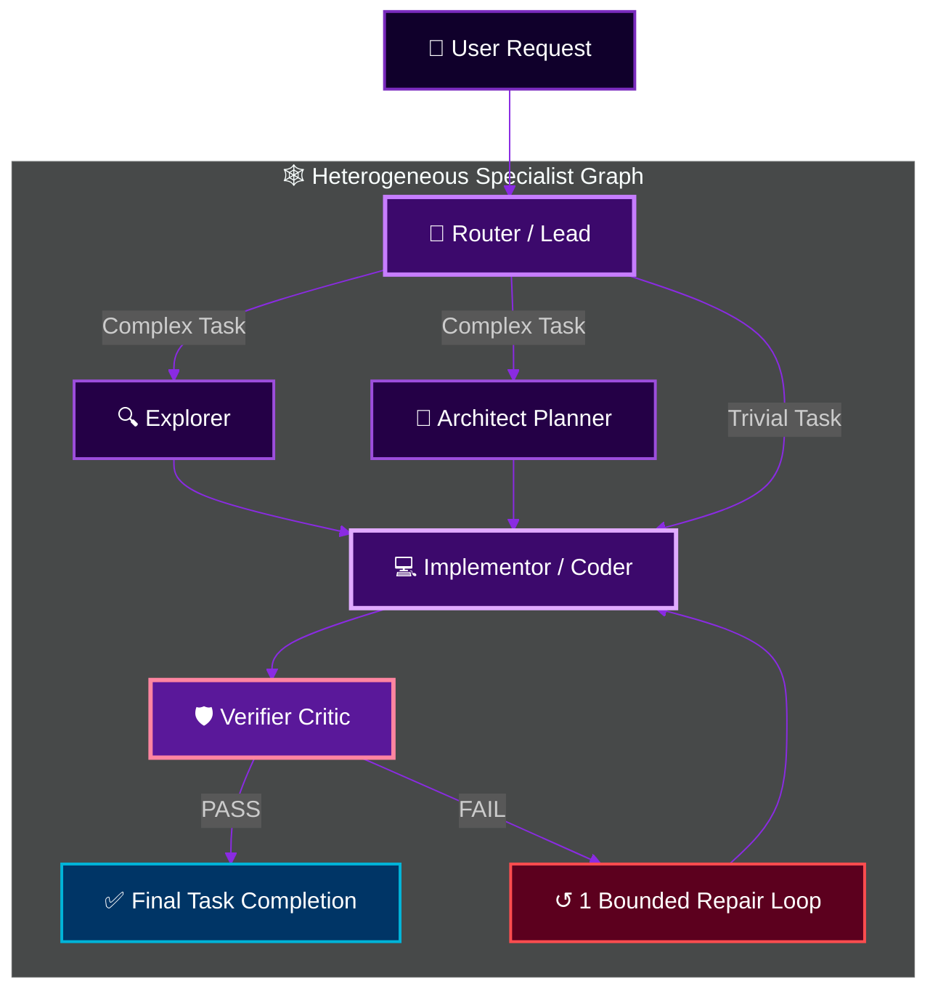

<p align="right">
  <a href="./README.md"><strong>English</strong></a> · <a href="./HETEROGENEOUS_AGENTS.md"><strong>Architecture Specs</strong></a>
</p>

<p align="center">
  
</p>

<div align="center">

[](https://github.com/shawn5cents)
[](https://github.com/router-for-me/Cli-Proxy-API)
[](HETEROGENEOUS_AGENTS.md)
[](https://www.rust-lang.org)
[](LICENSE)

<br>

**Created & Maintained by [shawn5cents](https://github.com/shawn5cents) (Nichols AI)**  
*Upstream Fork of xAI Grok Build with Universal Heterogeneous Subagent Routing.*

[🚀 Quick Start](#-quick-start) •
[🌐 Universal & Agnostic Architecture](#-universal--provider-agnostic) •
[🕸️ Multi-Agent DAG](#-heterogeneous-multi-agent-dag) •
[🎛️ Interactive Hub & Switcher](#-interactive-hub--configuration-tools) •
[🤝 Credits](#-credits--acknowledgements) •
[📄 License](LICENSE)

</div>

---

## 💡 Overview

**Grok Build Legion Edition** is a **100% Model-, CLI-, Provider-, and Gateway-Agnostic** terminal coding agent system. Built on xAI's high-performance Rust engine, Legion unlocks the ability to use **ANY model**, **ANY local or cloud provider**, **ANY gateway proxy**, and **ANY CLI tool** for each specialized subagent role (`orchestrator`, `explore`, `architect`, `implementor` coder, `verifier` critic).

> [!IMPORTANT]
> **Universal Freedom**: You are NEVER locked into specific models or providers. Whether you use local models (Ollama, LM Studio, vLLM), OpenCode Go & OpenCode Zen (`opencode/big-pickle`), NVIDIA NIM (`nvidia/*`), Venice AI (`venice/*`), 100% Free Tiers (`free-legion-dag`), cloud SaaS providers (OpenAI, DeepSeek, Anthropic, Gemini, Grok, MiniMax, Qwen, Moonshot), universal gateways (OpenRouter, ZenMux, Kilo Code, Cline Pass), or direct API endpoints — Legion automatically discovers and works with whatever you have configured!

---

## 🌐 Universal & Provider-Agnostic

Legion decouples agent roles from specific vendor lock-in:

- **Bring Any Model**: OpenCode Big Pickle (`opencode/big-pickle`), NVIDIA NIM (`nvidia/nemotron-3-ultra-550b`), Venice AI (`venice/hermes-3-llama-3.1-405b`), DeepSeek V4 Pro/Flash, Anthropic Claude 5 Sonnet/Opus, OpenAI GPT-5.6 Sol/Terra & Codex, Google Gemini 3.6 Flash, xAI Grok 4.5, MiniMax-M3, Qwen 3.7 Max, Moonshot Kimi K3, 100% Free Tier models, or local Ollama models.
- **Bring Any Gateway or Provider**: OpenCode Go (`http://localhost:4096`), NVIDIA NIM (`https://integrate.api.nvidia.com/v1`), Venice AI (`https://api.venice.ai/api/v1`), OpenRouter, ZenMux, Kilo Code, Cline Pass, CLIProxyAPI, LiteLLM, vLLM, local HTTP proxies, or direct SaaS API endpoints.
- **Bring Any CLI Tool**: Reports installed AI clients and configures models only when it finds a provider credential or a reachable OpenAI-compatible local service, avoiding unusable role assignments.
- **Upstream-Friendly Integration**: Legion-specific runtime changes stay focused on provider connection and subagent configuration paths to keep upstream updates straightforward.

---

## 🕸️ Heterogeneous Multi-Agent DAG

Legion allows assigning **ANY model** to **ANY specialized role** in a Directed Acyclic Graph (DAG):



---

## 🎛️ Interactive Hub & Configuration Tools

Legion ships with intuitive interactive tools so you can configure models and presets with zero TOML editing required:

| Command | Description |
|---|---|
| **Legion mode** *(Shift+Tab cycle or Settings → Permission mode)* | **In-TUI DAG Assignment Menu**: Selecting Legion opens the **Agents → Legion** tab, where `orchestrator`, `explore`, `architect`, `implementor`, and `verifier` can each be assigned any model from the live connected-provider catalog. Changes save immediately and hot-reload for subsequent subagent spawns. |
| **`legion-hub`** *(or `legion hub`)* | **Ultimate Visual Control Panel**: Browse model catalog by context window, assign models to roles (`architect`, `implementor`), select presets, view live DAG topology, and launch sessions. |
| **`legion-mode`** *(or `legion --mode`)* | **Preset Profile Switcher**: Instantly switch between profiles (`Legion DAG`, `Big Pickle DAG`, `Free Legion DAG`, `NVIDIA NIM DAG`, `Venice AI DAG`, `Cline/Codex`, `Auto-Discovered`) or run `legion-mode create` to build a custom preset. |
| **`legion-config`** | **Model & Role Editor**: Interactively change models for individual subagent roles or apply **one single LLM to ALL roles at once** (`legion-config --all <model>`). |
| **`./tools/auto-discover.py`** | **Zero-Touch Capability Scan**: Detects supported provider credentials (`OPENCODE`, `NVIDIA`, `VENICE`, `DEEPSEEK`, `ANTHROPIC`, `XAI`, `OPENAI`, `GEMINI`, `OPENROUTER`, `ZENMUX`, `KIMI`), reports installed AI clients, and probes local model endpoints to generate a routable profile. |
| **`/connect`** *(inside Legion)* | **Provider Connection Flow**: Validate a provider key without freezing the TUI, discover its models, and add provider-qualified runtime model entries to the live catalog and persistent configuration. |
| **`/model`** *(inside Legion)* | **Live Model Picker**: Switch to built-in or newly connected provider models immediately; successful `/connect` results appear without restarting Legion. |

---

## 🚀 Quick Start

### 1. Install Legion

```bash
git clone https://github.com/shawn5cents/grok-build-legion-edition.git
cd grok-build-legion-edition
./install.sh
```

The installer builds the runtime, installs the complete control-tool bundle and
built-in presets under `~/.local`, generates an auto-discovered profile on first
install, and keeps provider-bearing config files private. Reinstalling preserves
the active configuration. Set `GROK_HOME` to use a different configuration
directory.

### 2. Launch an Interactive Session

```bash
legion
```

### 3. Open the Interactive Control Hub

```bash
legion-hub
```

For command help, run `legion --help`, `legion-mode --help`,
`legion-config --help`, or `legion-hub --help`.

The role editor and Hub list only built-in or currently configured model
routes, so choosing a model also gives the runtime an endpoint and credential
source. Use the custom-model option after adding your own `[model.*]` entry.

---

## 🤝 Credits & Acknowledgements

- **Creator & Maintainer**: **[shawn5cents](https://github.com/shawn5cents)** (Nichols AI) — Designed the Universal Heterogeneous Multi-Agent DAG Architecture, Zero-Touch Auto-Discovery Engine, interactive Hub & switcher tools, and overall Legion system.
- **Provider Gateway Engine**: **[CLIProxyAPI](https://github.com/router-for-me/Cli-Proxy-API)** (by router-for-me) — High-performance Go proxy server enabling multi-account and multi-provider protocol routing.
- **Core Engine & Agent Runtime**: **SpaceXAI / xAI Team** — Creators of the original `Grok Build` (`grok`) terminal-based AI coding agent codebase.
- **README Visual Design**: Inspired by **[oil-oil/beautify-github-readme](https://github.com/oil-oil/beautify-github-readme)**.

---

<p align="center">
  
</p>

## 📄 License

First-party code is licensed under the **Apache License, Version 2.0** — see [`LICENSE`](LICENSE).
