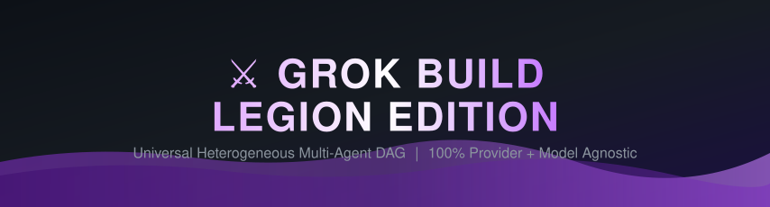
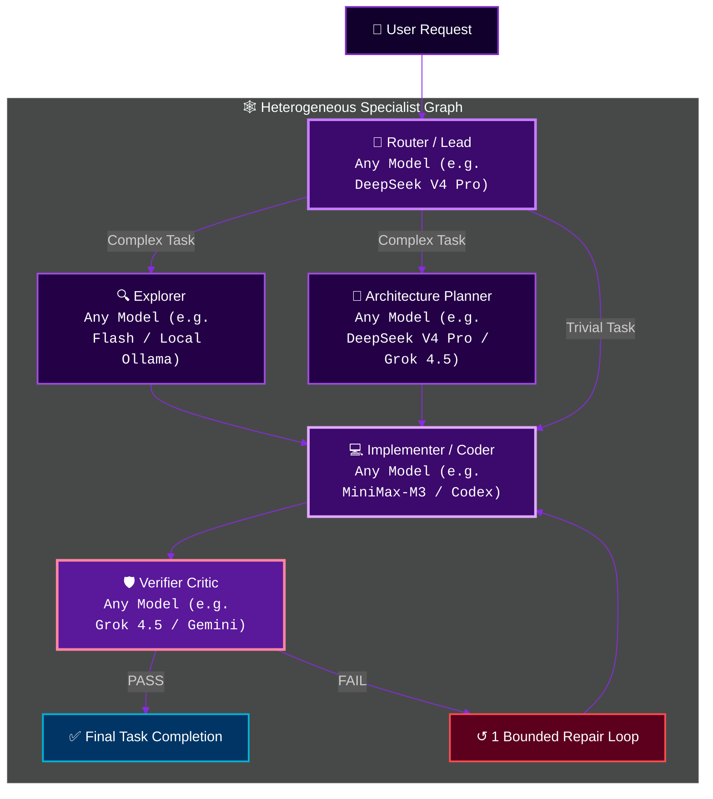

<p align="right">
  <a href="./README.md"><strong>English</strong></a> · <a href="./HETEROGENEOUS_AGENTS.md"><strong>Architecture Specs</strong></a>
</p>

<p align="center">
  
</p>

<div align="center">

[](https://github.com/shawn5cents)
[](https://github.com/router-for-me/Cli-Proxy-API)
[](HETEROGENEOUS_AGENTS.md)
[](https://www.rust-lang.org)
[](LICENSE)

<br>

**Created & Maintained by [shawn5cents](https://github.com/shawn5cents) (Nichols AI)**  
*Upstream Fork of xAI Grok Build with Universal Heterogeneous Subagent Routing.*

[🚀 Quick Start](#-quick-start) •
[🌐 Universal & Agnostic Architecture](#-universal--provider-agnostic) •
[🕸️ Multi-Agent DAG](#-heterogeneous-multi-agent-dag) •
[🎛️ Interactive Hub & Switcher](#-interactive-hub--configuration-tools) •
[🤝 Credits](#-credits--acknowledgements) •
[📄 License](LICENSE)

</div>

---

## 💡 Overview

**Grok Build Legion Edition** is a **100% Model-, CLI-, Provider-, and Gateway-Agnostic** terminal coding agent system. Built on xAI's high-performance Rust engine, Legion unlocks the ability to use **ANY model**, **ANY local or cloud provider**, **ANY gateway proxy**, and **ANY CLI tool** for each specialized subagent role (`orchestrator`, `explore`, `plan`, `general-purpose` coder, `verifier` critic).

> [!IMPORTANT]
> **Universal Freedom**: You are NEVER locked into specific models or providers. Whether you use local models (Ollama, LM Studio, vLLM), cloud SaaS providers (OpenAI, DeepSeek, Anthropic, Gemini, Grok, MiniMax, Qwen, Moonshot), universal gateways (CLIProxyAPI, LiteLLM, OpenRouter, ZenMux, Kilo Code, Cline Pass), or direct API endpoints — Legion automatically discovers and works with whatever you have configured!

---

## 🌐 Universal & Provider-Agnostic

Legion decouples agent roles from specific vendor lock-in:

- **Bring Any Model**: DeepSeek, OpenAI / Codex, Anthropic / Claude, Google Gemini, xAI Grok, MiniMax, Qwen, Mistral, Moonshot Kimi, Llama 3, CodeLlama, or local Ollama models.
- **Bring Any Gateway or Proxy**: `CLIProxyAPI`, LiteLLM, OpenRouter, ZenMux, Kilo Code, Cline Pass, vLLM, local HTTP proxies, or direct SaaS API endpoints.
- **Bring Any CLI Tool**: Automatically detects and leverages `ollama`, `opencode`, `codex`, `cline`, `agy`, `python3`, `go`, and local binaries installed on your system.
- **100% Upstream Git Hygiene**: Zero core engine modifications required — preserves 100% clean `git pull upstream main` compatibility.

---

## 🕸️ Heterogeneous Multi-Agent DAG

Legion allows assigning **ANY model** to **ANY specialized role** in a Directed Acyclic Graph (DAG):



---

## 🎛️ Interactive Hub & Configuration Tools

Legion ships with intuitive interactive tools so you can configure models and presets with zero TOML editing required:

| Command | Description |
|---|---|
| **`legion-hub`** *(or `legion hub`)* | **Ultimate Visual Control Panel**: Browse model catalog by context window, assign models to roles, select presets, view live DAG topology, and launch sessions. |
| **`legion-mode`** *(or `legion --mode`)* | **Preset Profile Switcher**: Instantly switch between profiles (`Original Grok 4.5`, `Legion DAG`, `Cline/Codex`, `Auto-Discovered`) or run `legion-mode create` to build a custom preset. |
| **`legion-config`** | **Model & Role Editor**: Interactively change models for individual subagent roles or apply **one single LLM to ALL roles at once** (`legion-config --all <model>`). |
| **`./tools/auto-discover.py`** | **Zero-Touch Capability Scan**: Automatically scans system API keys, local binaries (`ollama`, `opencode`, `codex`, `cline`, `agy`), and running proxies to generate a tailored profile. |

---

## 🚀 Quick Start

### 1. Install Legion

```bash
git clone https://github.com/shawn5cents/grok-build-legion-edition.git
cd grok-build-legion-edition
./install.sh
```

### 2. Launch an Interactive Session

```bash
legion
```

### 3. Open the Interactive Control Hub

```bash
legion-hub
```

---

## 🤝 Credits & Acknowledgements

- **Creator & Maintainer**: **[shawn5cents](https://github.com/shawn5cents)** (Nichols AI) — Designed the Universal Heterogeneous Multi-Agent DAG Architecture, Zero-Touch Auto-Discovery Engine, interactive Hub & switcher tools, and overall Legion system.
- **Provider Gateway Engine**: **[CLIProxyAPI](https://github.com/router-for-me/Cli-Proxy-API)** (by router-for-me) — High-performance Go proxy server enabling multi-account and multi-provider protocol routing.
- **Core Engine & Agent Runtime**: **SpaceXAI / xAI Team** — Creators of the original `Grok Build` (`grok`) terminal-based AI coding agent codebase.
- **README Visual Design**: Inspired by **[oil-oil/beautify-github-readme](https://github.com/oil-oil/beautify-github-readme)**.

---

<p align="center">
  
</p>

## 📄 License

First-party code is licensed under the **Apache License, Version 2.0** — see [`LICENSE`](LICENSE).
